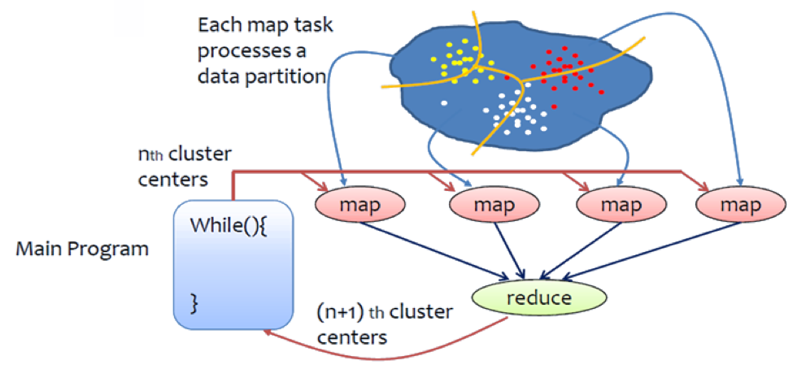

K-Means
=======

This section describes how to implement the K-means algorithm using Hadoop.

Understanding K-Means
-------------------
K-Means is a very powerful and easily understood clustering algorithm. The aim of the algorithm is to divide a given set of points into "K" partitions. "K" needs to be specified
by the user. In order to understand K-Means, first you need to understand the proceeding concepts and their meaning.

1. Centroids
    Centroids can be defined as the center of each cluster. If we are performing clustering with k=3, we will have 3 centroids. To perform K-Means clustering, the users needs to
    provide the initial set of centroids.

2. Distance
    In order to group data points as close together or as far-apart we need to define a distance between two given data points. In K-Means clustering distance is normally calculated as the Euclidean
    Distance between two data points.

The K-Means algorithm simply repeats the following set of steps until there is no change in the partition assignments, in that it has clarified which data point is
assigned to which partition.

    1. Choose K points as the initial set of centroids.
    2. Assign each data point in the data set to the closest centroid (this is done by calculating the distance between the data point and each centroid).
    3. Calculate the new centroids based on the clusters that were generated in step 2. Normally this is done by calculating the mean of each cluster.
    4. Repeat steps 2 and 3 until data points do not change cluster assignments, meaning their centroids are set.

Pseudo Code and Java Code 
------------------
Denote:

- N is the number of data points
- M is the number of centroids
- D is the dimension of centroids
- Vi refers to the ith data point(vector)
- Cj refers to the jth centroid

------------------
The Main Method
------------------

The tasks of the main class is to configure and run the job iteratively.

.. code-block:: java

    generate N data points (D dimensions), write to HDFS
    generate M centroids, write to HDFS
    for iterations{
        configure a job
        launch the job
    }

Now looking at the actual java implementation. The first step of the sample program is to generate a set of points. This is done using the following line in the main launch method. The actual method
that is in the Utils.java class is also shown for reference. This method generates a set of data points and writes them into the folder specified. The method also takes in parameters to specify the number
of files and number of data points that need to be generated. The data points are divided among the data files.

.. code-block:: java

    Utils.generateDataFiles(fs, dataDir,  numDataPoints, vectorSize, numFiles );

    // generateDataFiles method from Utils.java
    public static void generateDataFiles(FileSystem fs, Path dataDir, int numOfDataPoints, int vectorSize, int numFiles) throws IOException{
		Random random = new Random();
		int dataPerFile = numOfDataPoints / numFiles;
		int remainder = numOfDataPoints % numFiles;
		BufferedWriter br = null;
		Path pt = null;
		int dataThisFile = 0;
		for(int i=0; i < numFiles; i++){
			if(remainder > 0){
				dataThisFile = dataPerFile + 1;
				remainder -= 1;
			}else{
				dataThisFile = dataPerFile;
			}

			pt = new Path(KmeansConstants.DATA_DIR + "/data_"+i);
			br = new BufferedWriter(new OutputStreamWriter(fs.create(pt,true)));
			String aData="";
			for(int k = 0; k < dataThisFile; k++){
				aData = "";
				for(int j = 0; j < vectorSize; j++){
					int aElement = random.nextInt(1000);
					if( j != vectorSize-1 ){
						aData += aElement + "\t";
					}
					else{
						aData += aElement+ "\n";
					}
				}
				br.append(aData);
			}
			br.close();
			System.out.println("wrote to "+pt.getName());
		}
	}

The next step is to generate a set of centroids. As it was mentioned in the description K-Means needs a set of initial centroids. The "generateInitialCentroids" method in the Utils class
will generate a set of random centroids.

.. code-block:: java

    Utils.generateInitialCentroids(fs, cDir, numCentroids, vectorSize);

After the initialization steps are completed the main class will run a set of map reduce jobs iteratively. The number of iterations are specified by the user.
The following code block will at each iteration configure a job and run it.

.. code-block:: java

    for(int iter = 0; iter < numIteration; iter++){
        //delete output directory if existed
        if( fs.exists(outDir)){
            fs.delete(outDir, true);
        }

        job = configureAJob(configuration, iter, vectorSize, numCentroids,dataDir, outDir );

        try {
            job.waitForCompletion(true);
        }catch (Exception e){
            e.printStackTrace();
        }
        System.out.println("---------------------------| Iteration #" +iter + " Finished |-------------------------------");
    }

----------
The Mapper
----------

.. code-block:: java

    load centroids

    #The value of the input key-value pair is a data point Vi
    find the nearest centroid Cj for the data point Vi
    Context.write(j, <Vi, 1>)

Now looking at the java implementaion of the mapper class. First the setup method will be called to initialize the mapper class. In the setup method
all the needed configurations will be loaded. most importantly the set of centroids that are saved in the centroids file will be loaded into an array.
The main map task is handled in the map function.

In the map function it reads in each line from the data files and calculates distances between the current data point and each centroid to determine the closest centroid
to the data point. The index of the closest centroid is stored in the variable "minCentroid" for later use. The values in the "newCentroids" array is updated after finding the closest
centroid. "newCentroids" array contains the sum of all data points that are closest to each centroid. For example newCentroids[0] contains the sum of all data points that are closest to
centroid 0.

.. code-block:: java

    public void map(LongWritable key, Text val, Context context)
			throws IOException, InterruptedException {

		//1.2 construct the input data point
		String valStr[] = val.toString().split("\t");
		double data[] = new double[VECTOR_SIZE];
		for (int i = 0; i < VECTOR_SIZE; i++)
			data[i] = (double) Integer.parseInt(valStr[i]);

		//1.3 find nearest centroid for the input data point.
		double distance = 0;
		int minCentroid = 0;
		double minDistance=0;
		for (int i = 0; i < NUM_CENTROIDS; i++) {
			distance = Utils.getEuclidean2(centroids[i], data, VECTOR_SIZE);
			if(i == 0){
				minDistance = distance;
				minCentroid = i;
			}
			else if (distance < minDistance) {
				minDistance = distance;
				minCentroid = i;
			}
		}
		for (int i = 0; i < VECTOR_SIZE; i++){
			newCentroids[minCentroid][i] += data[i];
		}
		cCounts[minCentroid] += 1;
	}

After the map task is completed the cleanup function will write the output of the map task which will be sent to the reduce tasks. the following code segment in the cleanup method
will iterate over all the centroids and write a key value pair where the key is the id of the centroid and  value is the sum of data assigned to this centroid, and the count of these data points.

.. code-block:: java

    for (int i = 0; i < NUM_CENTROIDS; i++) {
        context.write(new IntWritable(i), new CentroidCountWritable(newCentroids[i], VECTOR_SIZE, cCounts[i]));
    }

-----------
The Reducer
-----------

.. code-block:: java

    #The key is an ID of a centroid, the value list is a list of <Vi, 1>
    newCentroid = a new D dimensional vector
    count = 0
    for each pair <Vi, 1> in the value list{
        for k in 0 to (D-1) {
            newCentroid[k] += Vi[k]
        }
        count += 1
    }

    for k in 0 to (D-1) {
            newCentroid[k] /= count
    }

    output newCentroid to HDFS

In the java implementation of the reducer class similar to the mapper class the setup method will perform the basic initialization functions of the class. after the setup is done the
main reducer tasks will be handled in the reduce method.

The reduce task will receive a key value pair which was outputted from the map functions. where the key is the id of the centroid and  value is the sum of data assigned to this centroid, and the count of these data points.
during the reduce phase all the key value pairs with the same key will be merged to calculate the sum of all the data points that are assigned to each centroid and to calculate
the total number of data points assigned to each centroid

.. code-block:: bash

    public void reduce(IntWritable key, Iterable<CentroidCountWritable> values, Context context)
			throws IOException, InterruptedException {
		//1.1 reduce centroids
		int index = key.get();
		for (CentroidCountWritable value : values) {
			double[] strData = value.getValueArrary();
			for (int i = 0; i < VECTOR_SIZE; i++)
				newCentroids[index][i] += strData[i];
			cCounts[index] += value.getcCount();
		}
	}

After the reducer is completed the cleanup method will compute the new centroids  using the sum of data points in each centroid and count of data points in each
centroid ( these values are calculated in the reduce phase ). And then it will write the newly calculated centroid values to the centroid file.

In the next iteration these newly created centroids will be read in by the map task when performing calculations.

Compile the Code
----------------
The code is available at https://github.com/ADMIcloud/examples. Download the code by using the git clone command or by clicking the Download Zip button. Then go to the hadoop-kmeans directory and compile the code.

.. code-block:: bash

    git clone https://github.com/ADMIcloud/examples.git
    cd examples/hadoop-kmeans
    mvn clean install

Run the Code
------------
The usage is:

.. code-block:: bash

    $HADOOP_PREFIX/bin/hadoop jar target/hadoop-kmeans-1.0.jar admicloud.hadoop.kmeans.KmeansMain <num Of Data Points> <size of a vector> <num of Centroids> <number of map tasks> <number of iterations>

For example

.. code-block:: bash

    $HADOOP_PREFIX/bin/hadoop jar target/hadoop-kmeans-1.0.jar admicloud.hadoop.kmeans.KmeansMain 100 3 10 2 3

Hadoop K-means wil firstly generate 100 data points, each a 3-D vector. The data will be saved to HDFS. It then generates 10 initial centroids and writes them to HDFS. For every iteration, K-means loads centroids and reads key-value pairs to do computation, then writes new centroids back to HDFS.

View the Results
----------------

.. code-block:: bash

    $HADOOP_PREFIX/bin/hdfs dfs -ls -R kmeans
    kmeans/centroids
    kmeans/centroids/centroids_0
    kmeans/centroids/centroids_1
    kmeans/centroids/centroids_2
    kmeans/centroids/centroids_3
    kmeans/data
    kmeans/data/data_0
    kmeans/data/data_1
    kmeans/out
    kmeans/out/_SUCCESS
    kmeans/out/part-r-00000

In this example, data_0 and data_1 are data files. The data in file centroids_0 is the initial centroids. The data in file centroids_3 is the final result after 3 iterations.
